# Credit_Risk_Analysis

## Project Overview

Credit risk is an inherently unbalanced classification problem, as good loans easily outnumber risky loans. Therefore, we will need to employ different techniques to train and evaluate models with unbalanced classes. In this challenge, we use python to build several machine learning models, then evaluate the performance of these models and make a written recommendation on whether they should be used to predict credit risk:

1. oversample the data using the RandomOverSampler and SMOTE algorithms;
2. undersample the data using the ClusterCentroids algorithm;
3. use a combinatorial approach of over- and undersampling using the SMOTEENN algorithm;
4. compare two machine learning models that reduce bias, BalancedRandomForestClassifier and EasyEnsembleClassifier.

## Results

### Oversample the data with RandomOverSampler

<table align="left">
  <tr height=50px>
    <th>Accuracy Score</th>
    <th>Confusion Matrix</th>
    <th>Classification Report</th>
  </tr>
  <tr>
    <td> 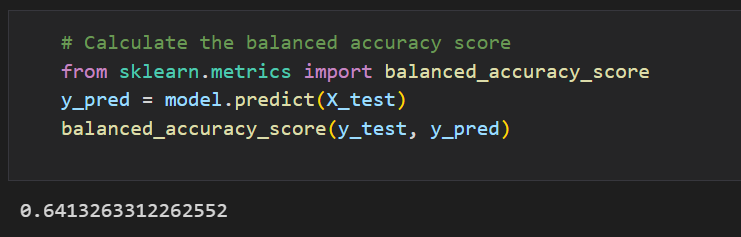
    <td> 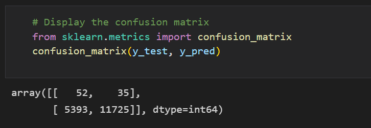
    <td> 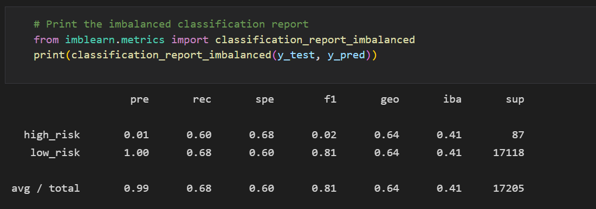
  </tr>
</table>
  
  
- balanced accuracy score is 64%.
- high_risk precision is about 1% only with 62% sensitivity
- recall is very low at 2% only.
 

### Oversample the data with the SMOTE algorithm

<table align="left">
  <tr height=50px>
    <th>Accuracy Score</th>
    <th>Confusion Matrix</th>
    <th>Classification Report</th>
  </tr>
  <tr>
    <td> 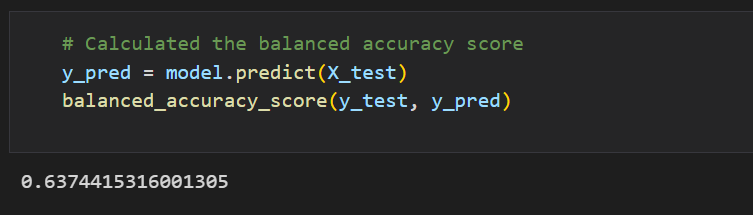
    <td> 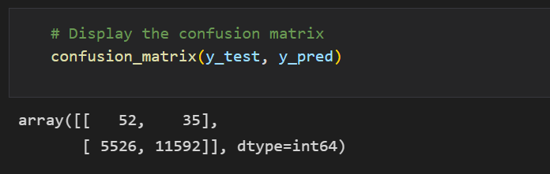
    <td> 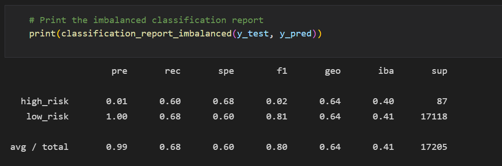
  </tr>
</table>
  

- balanced accuracy score is 65%.
- high_risk precision is about 1% only with 62% sensitivity
- recall is very low at 2% only.
 

### Undersample the data with the ClusterCentroids algorithm

<table align="left">
  <tr height=50px>
    <th>Accuracy Score</th>
    <th>Confusion Matrix</th>
    <th>Classification Report</th>
  </tr>
  <tr>
    <td> 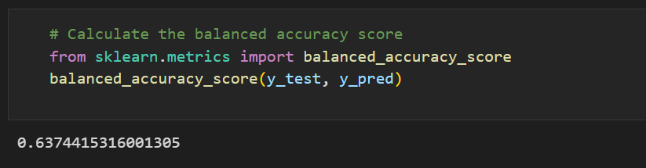
    <td> 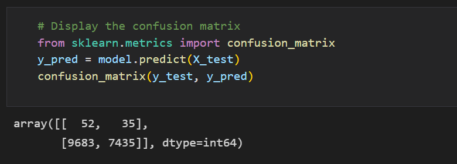
    <td> 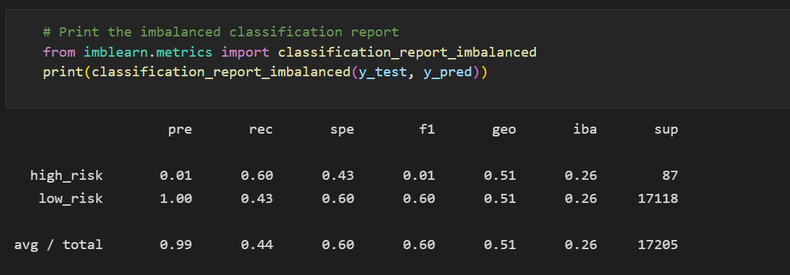
  </tr>
</table>
  

- balanced accuracy score is 65%.
- high_risk precision is about 1% only with 62% sensitivity
- recall is very low at 2% only.
 

### Over- and undersampling with the SMOTEENN algorithm

<table align="left">
  <tr height=50px>
    <th>Accuracy Score</th>
    <th>Confusion Matrix</th>
    <th>Classification Report</th>
  </tr>
  <tr>
    <td> 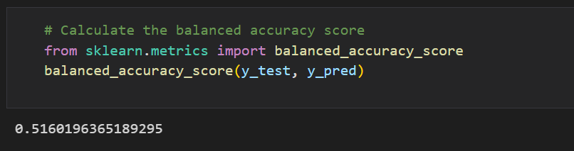
    <td> 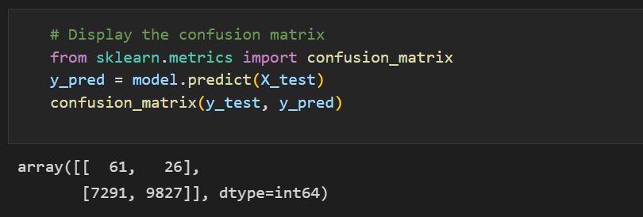
    <td> 
  </tr>
</table>
  

- balanced accuracy score is 65%.
- high_risk precision is about 1% only with 62% sensitivity
- recall is very low at 2% only.
 

### BalancedRandomForestClassifier

<table align="left">
  <tr height=50px>
    <th>Accuracy Score</th>
    <th>Confusion Matrix</th>
    <th>Classification Report</th>
  </tr>
  <tr>
    <td> 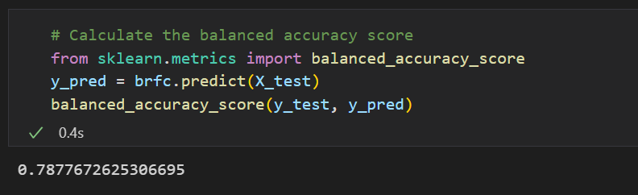
    <td> 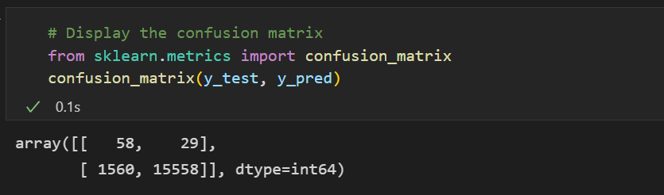
    <td> 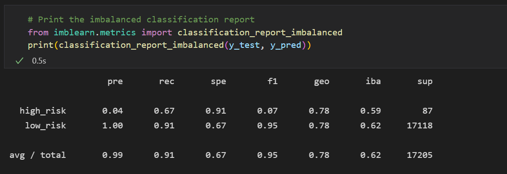
  </tr>
</table>
  

- balanced accuracy score is 65%.
- high_risk precision is about 1% only with 62% sensitivity
- recall is very low at 2% only.
 

### EasyEnsembleClassifier

<table align="left">
  <tr height=50px>
    <th>Accuracy Score</th>
    <th>Confusion Matrix</th>
    <th>Classification Report</th>
  </tr>
  <tr>
    <td> 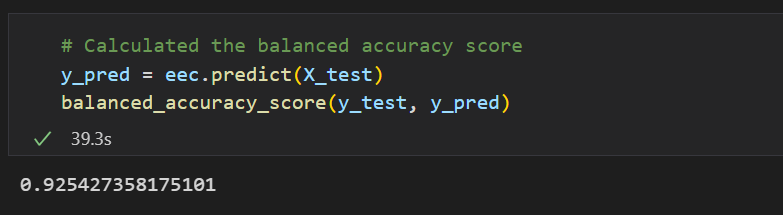
    <td> 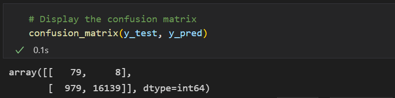
    <td> 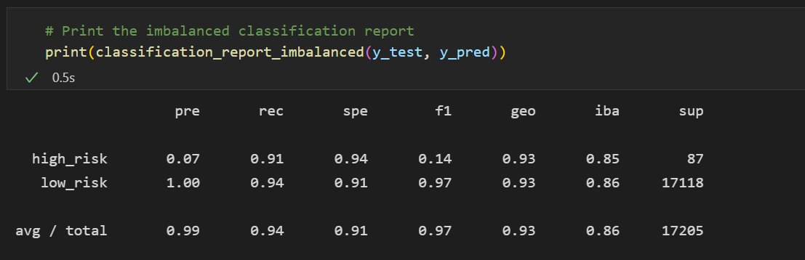
  </tr>
</table>
  

- balanced accuracy score is 65%.
- high_risk precision is about 1% only with 62% sensitivity
- recall is very low at 2% only.
 

## Summary

