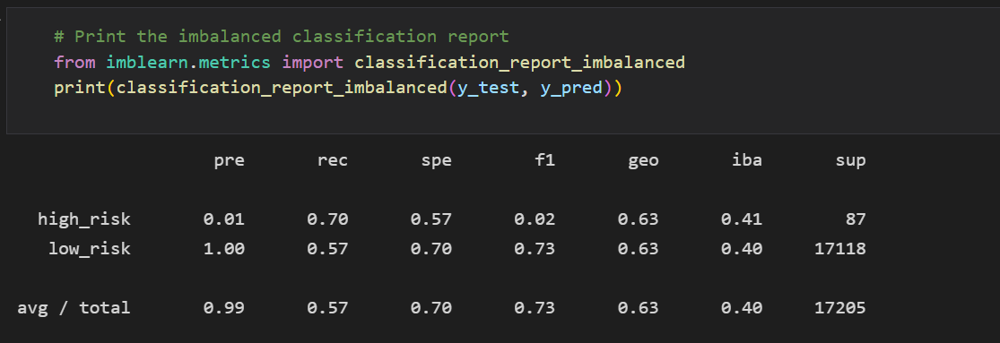

# Credit_Risk_Analysis

## Project Overview

Credit risk is an inherently unbalanced classification problem, as good loans easily outnumber risky loans. Therefore, we will need to employ different techniques to train and evaluate models with unbalanced classes. In this challenge, we use python to build several machine learning models, then evaluate the performance of these models and make a written recommendation on whether they should be used to predict credit risk:

1. oversample the data using the RandomOverSampler and SMOTE algorithms;
2. undersample the data using the ClusterCentroids algorithm;
3. use a combinatorial approach of over- and undersampling using the SMOTEENN algorithm;
4. compare two machine learning models that reduce bias, BalancedRandomForestClassifier and EasyEnsembleClassifier.

## Results

### Oversample the data with RandomOverSampler

<table align="left">
  <tr height=50px>
    <th>Accuracy Score</th>
    <th>Confusion Matrix</th>
    <th>Classification Report</th>
  </tr>
  <tr>
    <td> 
    <td> 
    <td> 
  </tr>
</table>
  
  
Looking at the individual variable p-values in the summary output (left here), each Pr(>|t|) value represents the probability that each coefficient contributes a random amount of variance to the linear model. According to our results, vehicle length and ground clearance (as well as intercept) are statistically unlikely (<=0.05) to provide random amounts of variance to the linear model. In other words the vehicle length and ground clearance have a significant impact on mpg efficiency.
 

### Oversample the data with the SMOTE algorithm

<table align="left">
  <tr height=50px>
    <th>Accuracy Score</th>
    <th>Confusion Matrix</th>
    <th>Classification Report</th>
  </tr>
  <tr>
    <td> 
    <td> 
    <td> 
  </tr>
</table>
  

Looking at the individual variable p-values in the summary output (left here), each Pr(>|t|) value represents the probability that each coefficient contributes a random amount of variance to the linear model. According to our results, vehicle length and ground clearance (as well as intercept) are statistically unlikely (<=0.05) to provide random amounts of variance to the linear model. In other words the vehicle length and ground clearance have a significant impact on mpg efficiency.
 

### Undersample the data with the ClusterCentroids algorithm

<table align="left">
  <tr height=50px>
    <th>Accuracy Score</th>
    <th>Confusion Matrix</th>
    <th>Classification Report</th>
  </tr>
  <tr>
    <td> 
    <td> 
    <td> 
  </tr>
</table>
  

Looking at the individual variable p-values in the summary output (left here), each Pr(>|t|) value represents the probability that each coefficient contributes a random amount of variance to the linear model. According to our results, vehicle length and ground clearance (as well as intercept) are statistically unlikely (<=0.05) to provide random amounts of variance to the linear model. In other words the vehicle length and ground clearance have a significant impact on mpg efficiency.
 

### Over- and undersampling with the SMOTEENN algorithm

<table align="left">
  <tr height=50px>
    <th>Accuracy Score</th>
    <th>Confusion Matrix</th>
    <th>Classification Report</th>
  </tr>
  <tr>
    <td> 
    <td> 
    <td> 
  </tr>
</table>
  

Looking at the individual variable p-values in the summary output (left here), each Pr(>|t|) value represents the probability that each coefficient contributes a random amount of variance to the linear model. According to our results, vehicle length and ground clearance (as well as intercept) are statistically unlikely (<=0.05) to provide random amounts of variance to the linear model. In other words the vehicle length and ground clearance have a significant impact on mpg efficiency.
 

### BalancedRandomForestClassifier

<table align="left">
  <tr height=50px>
    <th>Accuracy Score</th>
    <th>Confusion Matrix</th>
    <th>Classification Report</th>
  </tr>
  <tr>
    <td> 
    <td> 
    <td> 
  </tr>
</table>
  

Looking at the individual variable p-values in the summary output (left here), each Pr(>|t|) value represents the probability that each coefficient contributes a random amount of variance to the linear model. According to our results, vehicle length and ground clearance (as well as intercept) are statistically unlikely (<=0.05) to provide random amounts of variance to the linear model. In other words the vehicle length and ground clearance have a significant impact on mpg efficiency.
 

### EasyEnsembleClassifier

<table align="left">
  <tr height=50px>
    <th>Accuracy Score</th>
    <th>Confusion Matrix</th>
    <th>Classification Report</th>
  </tr>
  <tr>
    <td> 
    <td> 
    <td> 
  </tr>
</table>
  

Looking at the individual variable p-values in the summary output (left here), each Pr(>|t|) value represents the probability that each coefficient contributes a random amount of variance to the linear model. According to our results, vehicle length and ground clearance (as well as intercept) are statistically unlikely (<=0.05) to provide random amounts of variance to the linear model. In other words the vehicle length and ground clearance have a significant impact on mpg efficiency.
 

## Summary

